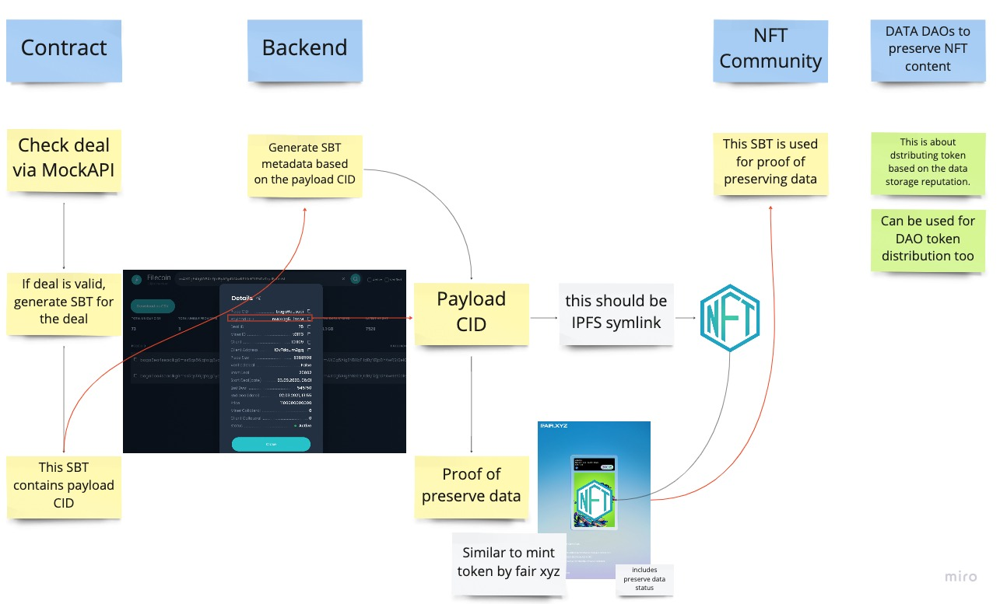
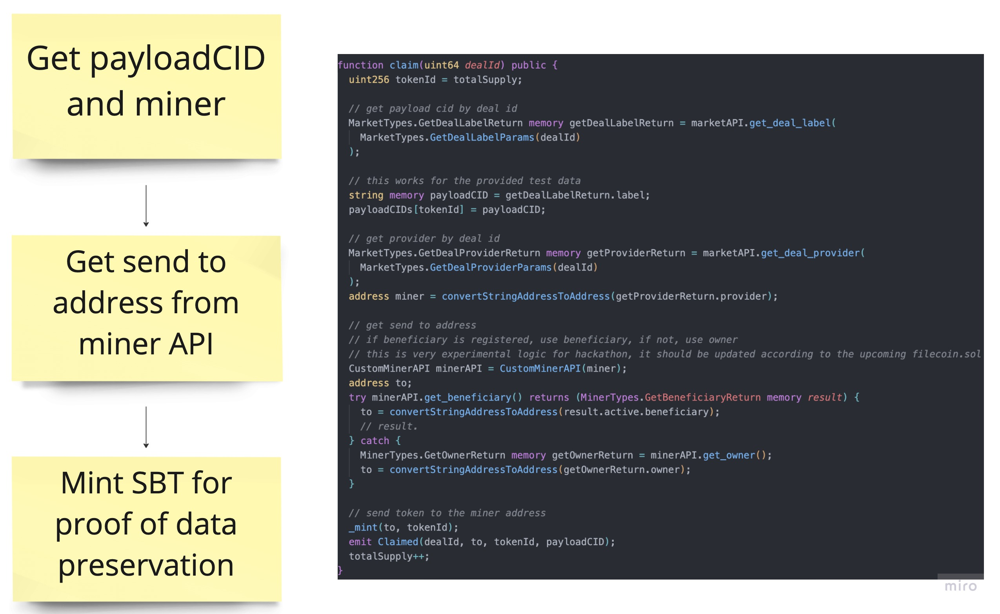
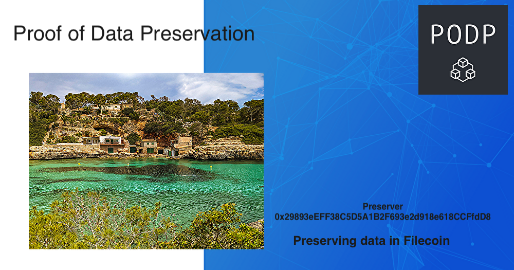

# PODP - HackFEVM Submission

PODP is Proof Of Data Preservation for Filecoin Ecosystem

## Submission

### Live App

https://podp.vercel.app/

## Problem

One of the best practices of NFT data management is using IPFS. However, the content tends to be managed only by the creator. The content may be disappeared in the future.


## Solution

One of the solutions to this is to make the incentive to preserve the NFT-related data for the community members.

And that is where PODP comes in.

PODP provides very cool SBTs to data preservers, which can be used as proof of preserving essential data for the community.

## How it works



## Core Development Note

### Smart Contract

https://github.com/taijusanagi/PODP/blob/main/packages/contracts/contracts/ProofOfDataPreservation.sol#L22



### Deta Retrieval with filecoin.js

This is tested here
https://github.com/taijusanagi/PODP/blob/main/packages/contracts/tasks/test-filecoin-js.ts#L37

This code is not documented yet so [I found out how to do that by myself](https://discord.com/channels/554623348622098432/822657841420435486/1043764320175149096).

### Image generation for the SBT

SBT is used to prove data preservation, and I want to make the SBT as cool as possible so that users think "I want to share this cool SBT with other community members!"

This is inspired by [Minter Token by Fair.xyz](https://minter.fair.xyz/)

This image is still under development



### Deployed Contract

```
customMinerAPI 0x5E1417C303048C7FF12e678574e3b48b3B941Ad1
customMarketAPI 0x5E1417C303048C7FF12e678574e3b48b3B941Ad1
proofOfDataPreservation 0x5E1417C303048C7FF12e678574e3b48b3B941Ad1
```

### Testing

to test the smart contract functionality, please run

```
yarn test
```

## Lotus Node

I keep some of the important notes for the development

### Lotus

Running the local Lotus node for testnet

```
FULLNODE_API_INFO=wss://wss.wallaby.node.glif.io/apigw/lotus lotus daemon --lite
```

and create wallet

```
lotus wallet new
=> f1lluo4ltqdzcvb7h6bnf3a7lo3lpz6j5tskxr2my
```

Then get the test token to the address by [faucet](https://wallaby.network/#faucet)

https://explorer.glif.io/message/?network=wallabynet&cid=bafy2bzaceanh37nauda6zvdxylwkj4hbloouhj27pzbdk5y76hjso4ryiirrs

### Deta Retrieval

Using the suggested deal

https://wallaby.filecoin.tools/baga6ea4seaqlkg6mss5qs56jqtajg5ycrhpkj2b66cgdkukf2qjmmzz6ayksuci

Payload CID: mAXCg5AIg8YBXbFjtdBy1iZjpDYAwRSt0elGLF5GvTqulEii1VcM

### Data Retrieval

Data retrieval is done by

```
// you must run lotus in local envirionment and have some FIL in the wallet
lotus client retrieve --provider t01113 mAXCg5AIg8YBXbFjtdBy1iZjpDYAwRSt0elGLF5GvTqulEii1VcM data/mAXCg5AIg8YBXbFjtdBy1iZjpDYAwRSt0elGLF5GvTqulEii1VcM.png
```

and the retrieved image is [mAXCg5AIg8YBXbFjtdBy1iZjpDYAwRSt0elGLF5GvTqulEii1VcM+MfeeP1bT8OOGb4A](./data/mAXCg5AIg8YBXbFjtdBy1iZjpDYAwRSt0elGLF5GvTqulEii1VcM.png)

For this hackathon, the above image is used for testing.
